# Toy App Exercise Repo

This is a exercise repository for Developing Android Apps. You can learn more about how to use this repository [here](https://classroom.udacity.com/courses/ud851/lessons/93affc67-3f0b-4f9b-b3a4-a7a26f241a86/concepts/115d08bb-f114-46fa-b693-5c6ce1445c07)

# Video Walkthrough

## [course link](https://classroom.udacity.com/courses/ud851)

### Lesson 03 Green RecyclerView
Learin how RecycleView works. Show what views are reused, and when to create a new view. 
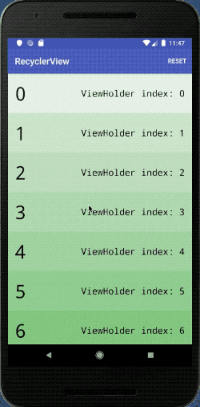 

2. **ViewHolder** - add RecyclerView and ViewHolder
3. **RecyclerViewAdapter** - RecyclerViewAdapter and ViewHolder
4. **WiringUpRecyclerView** - LayoutManager and RecyclerView: how to connet RecyclerView to activity
5. **GoingGreen** - add color when ViewHolder created to show how system recycle view
6. **RefreshMenuButton** - add refresh button to show how system recycle view
7. **RecyclerViewClickHandling** - Click on RecyclerView

### Lesson04a Starting New Activities
Learn how to pass information to another Activity. 
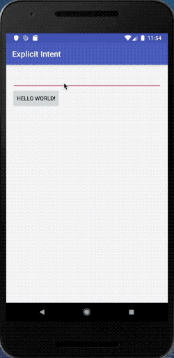 

- Passing Data Between Activities

### Lesson04b Webpages Maps and Sharing
Learn how to use implicit intents. Including open a website, open map application and open email. 
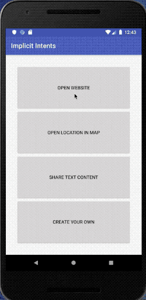 

1. **OpenWebpage** - 隐式intent:打开网页
2. **OpenMap** - 隐式intent:打开地图
3. **ShareText** - 隐式intent实施共享

### Lesson05a Android - Lifecycle and Persist data
Learn the lifecycle of the application, and learn how to store the data in the entire lifecycle. 旋转保存数据. android在memory不够时会自动关闭background程序，最后调用的method是 `onStop`, 也就是说不会掉用`onDestroy`, 你要为这些情况做好准备clean resources。  
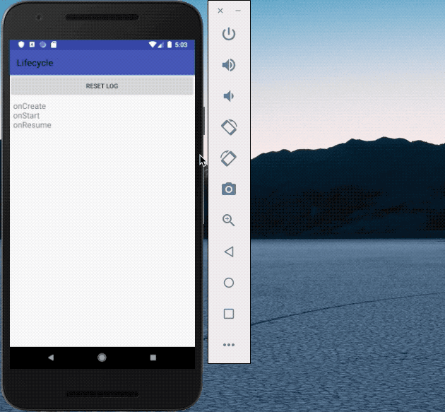 

1. **LogLifecycle** - 观察Activity生命周期
2. **PersistData** - Exercise-PersistData
3. **FixLifecycleDisplayBug** - 保存Activity的整个生命周期的数据, 用一个static list来保存`onStop`和`onDestroy`

### Lesson05b Smarter GitHub Repo Search - AsyncTaskLoader
edge case: 正在下载的时候旋转屏幕，得到的result会传递给一个已经不存在的activity。使用component LoaderManager的Loader，他们的生命超过activity的生命周期来避免重复加载。如果我们需要在background thread load data，使用AsyncTaskLoader
Learn to use AsyncTaskLoader, and prevent the reload after the user back into the App. 
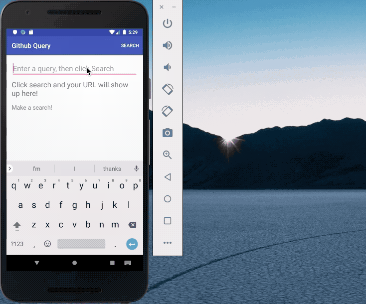 

1. **SaveResults** - 旋转设备后保存搜索结果
2. **AsyncTaskLoader 的使用** - 把AsyncTask改成`AsyncTaskLoader`，只处理旋转的加载问题，但是如果用户离开再回来就会重新加载，用3来处理这个问题。使用 `AsyncTaskLoader` 后就不需要用 onSaveInstanceState 记录的结果
3. **PolishAsyncTask** - 缓存加载器结果，防止客户离开应用后出现查询

### Lesson06 Visualizer - Preferences
Learn how to use Preference to store the data of the settings. 
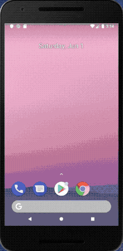 

1. **SetupTheActivity** - 新建SettingActivity: 偏好设置
2. **MakeAPreferenceFragment** - 新建PreferenceFragment，添加dependency，连接fragment，添加theme
3. **ReadingFromSharedPreferences** - 用偏好值修改默认配置
4. **UseResources** - 使用string, boolean资源规范化
5. **PreferenceChangeListener** - 扩展 SharedPreference 更改监听器并覆盖其方法，以更新偏好设置更改
6. **AddTwoMoreCheckboxes** - 跟之前一样的步骤再添加2个复选框
7. **ListPreference** 添加一个新的列表类型的偏好设置，使用户能够更改 Visualizer 应用的颜色主题
8. **PreferenceSummary** - 更新列表偏好设置项目的摘要
9. **EditTextPreference** - 添加一个新的偏好设置，以便接收用户输入的数字值，并用作大小倍增值，以调整 Visualizer 应用中的形状。
10. **EditTextPreferenceConstraints** - 给偏好设置可接受范围

### Lesson07 Waitlist
Implement a Waitlist App. Learn how to use database. 
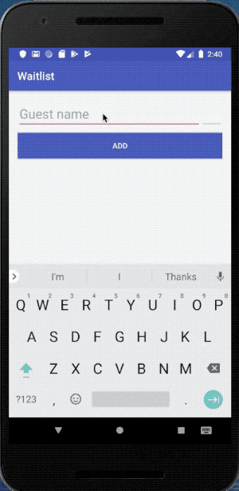 

1. **CreateAContract** - 数据库：创建Contract
2. **CreateTheDatabase** - 用SQLiteOpenHelper创建table 
3. **GetAllTheData** - 为 waitlist 应用创建的 SQLite 数据库运行选择查询，并更新列表以根据查询结果显示行数。
4. **UpdateTheAdapter** - 更新Adapter以便刷新 recycler 视图并显示从数据库中检索的实际宾客列表
5. **AddGuests** - 向数据库中添加宾客
6. **RemoveGuests** - 滑动删除数据库item，删除宾客信息

### Lesson08 Quiz Example
Learn to use ContentProvider and read the data from another App. 
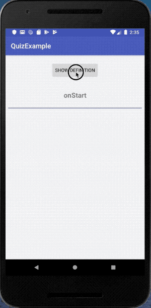 

1. **AddTheContentProviderPermission** - 添加permission, 读取另一个app的ContentProvider数据库的许可
2. **AddAsyncTaskToRetrieveCursor** - 用AsyncTask来得到另一个app的数据
3. **FinishQuizExample** - 使用Cursor的moveToNext读取数据

### Lesson09 ToDo-List - Database
Implement a To-Do-List App and use database to store the data. 
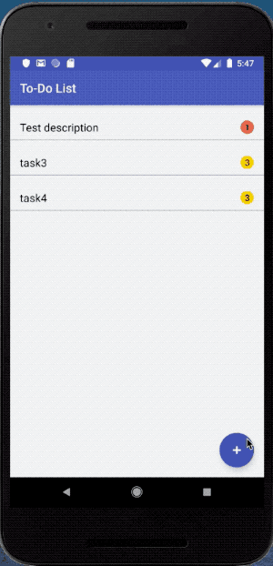 

1. **SetupContentProvider** - 构建和注册自定义内容提供器
2. **AddURIsToContract** - 向 Contract 添加必要的 URI。
3. **UriMatcher** - 构建 UriMatcher, 用来解析传入的uri
4. **Insert** - 数据库insert操作
5. **QueryAllTasks** - 数据库query
6. **Delete** - 实现ContentProvider删除，但还没和Activity连起来
7. **SwipeToDelete** - 滑动删除条目

### Lesson10 Hydration Reminder - IntentServices
**如果要加载用于界面的内容，用Loader。如果处理的内容与界面无关就用service**

Learn how to use Service and send notifications and schedule the job work in background.

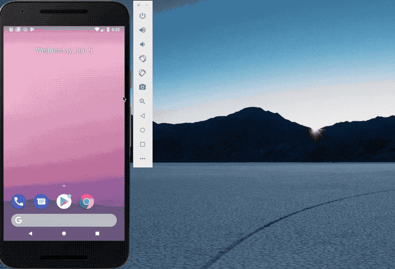 

1. **IntentServices 的简单实现** - 点击图片后，使用service增加水计数器，同时增加preference的水计数器。有简单的 preference 和 OnSharedPreferenceChangeListener 的操作。
2. **Notification 的简单实现** - 按下按钮，在顶部弹出通知，PendingIntent，NotificationManager，NotificationCompat.Builder-CreateNotification
3. **Notification Actions** - 在弹出的通知上增加2个action按钮：1个是已经喝过水了（水量+1），1个是忽略所有通知。 NotificationCompat.Action， PendingIntent， notificationManager.cancelAll();-NotificationActions
4. **Periodic Sync With JobDispatcher** - 添加JobService, 创建WaterReminderFirebaseJobService, 它是一个扩展自JobService的类，并且不在主线程上运行充电提醒任务，并增加dependence和修改Manifest -PeriodicSyncWithJobDispatcher  
4.2. schedule刚刚生成的Job，照以下条件安排运行时间：1.每隔 15 分钟运行一次，具有 15 分钟的灵活间隔时间。 2.仅在手机充电时运行。3.安排好后就一直运行，即使用户重启设备也如此---GooglePlayDriver， FirebaseJobDispatcher， dispatcher.newJobBuilder()-PeriodicSyncWithJobDispatcher
5. **Charging Broadcast Receiver** - Dynamic Broadcast receiver: 设备在充电是插头显示红色，否则就是灰色 --- 使用BroadcastReceiver, IntentFilte -ChargingBroadcastReceiver
6. **Sticky Broadcast For Charging** - 修复之前代码的 bug。让程序在onResume时得到手机是否在充电，根据这个更新图标。之前的bug：我们的应用分别在 onResume 和 onPause 中添加及删除动态广播接收器。当应用不可见时，插头的图标将不更新。这样的话，有时候当应用启动时，插头的图标可能不对。--- BatteryManager，Sticky Intent，context.registerReceiver(null, ifilter) -StickyBroadcastForCharging

### Lesson11 Completeing The UI - LandscapeLayout
Learn to use ConstraintLayout to design a boarding pass. Use different layout in landscape mode. 
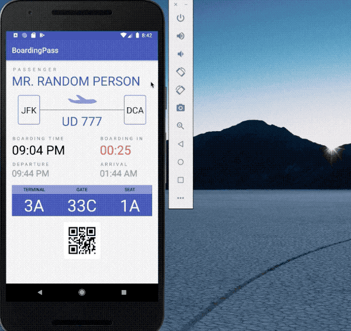 

1. **ConstraintLayout** - 用ConstraintLayout设计登机牌 
2. **DataBinding** - 用DataBinding来绑定数据，而不是findViewById()
3. **LandscapeLayout** - 为登机牌应用实现另一种布局，从而支持横向模式。 

### Lesson12 Visual Polish
Learn how to polish an app. Including color, font, style, different layout for different size of the screens, touch selector. 
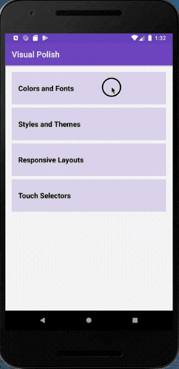 

1. **ColorsAndFonts** - 向 Colors 和 Fonts Activity 添加颜色和字体。-ColorsAndFonts
2. **CreateNewStyles** - 创建并应用新的样式，使此应用中的 TextView 保持一致性。-CreateNewStyles
3. **TabletLayout** - 为更大尺寸的平板电脑屏幕创建新的布局 -TabletLayout
4. **TouchSelector** - 点击按钮效果，用selector -TouchSelector

## [Advanced course link](https://classroom.udacity.com/courses/ud855)

### Advanced-Lesson01 AndoridMe - Fragment
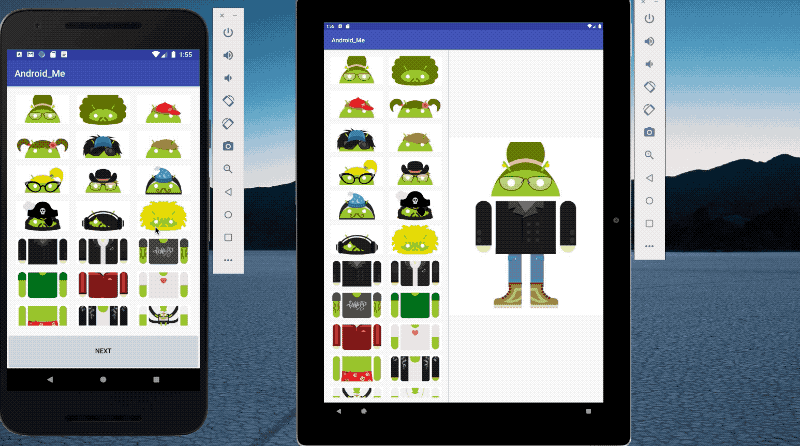 

1. **Fragment** - create a new fragment and add it to activity. 新建一个fragment并加入activity
2. **DisplayThreeFragments** - add 2 fragments, 增加另2个fragment，body and leg
3. **ClicksAndSavingState** - add onClickListener and save state when rotate the screen. 1. 点击就换下一张图片。2. 用onSaveInstanceState保存状态，旋转屏幕
时保存状态！-ClicksAndSavingState
4. **CreateMasterListFragment** - 创建 MasterListFragment, 是一个静态fragment grid view。
5. **InterfaceCommunication** - The communication between Fragment and it's host Activity. -InterfaceCommunication
6. **CommunicateBetweenActivities' Fragment** - 不同Activity的fragment的通信, 先在MasterFragment中定义一个interface，在MasterActivity中override它，实现具体点击的代码， 用bundle传递信息给DetailActivity.
7. **TwoPaneUI** - 为平板电脑视图创建双窗格布局。

### Advanced-Lesson02 Emojify - LIBRARY
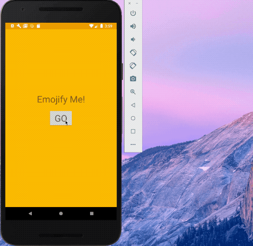 

1. **Add Gradle Dependency**
2. **DetectFaces** - Add Firebase to emojify, and 配置gradle文件，detect how many faces are there in the picture.
3. **GetClassificationProbabilities** - 得到每个face：微笑，左眼睁开，右眼睁开的概率
4. **MatchFaceToEmoji** - 根据微笑，左右眼睁眼的概率判断emoji表情（定一个threshold，按情况分类）
5. **DrawEmojiOverFaces** - 在脸上添加emoji表情
6. **AddButterknife** - 用库Butterknife绑定 视图和id 方便编程
7. **AddTimber** - 使用库 Timber：简化log 

### Advanced-Lesson03 Squawker - FCM
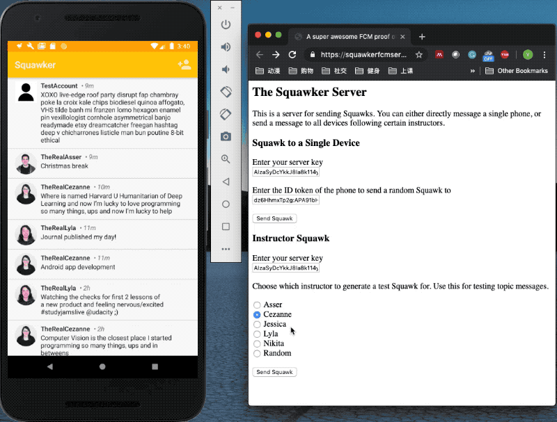 

1. **AddGradleDependencies** - 添加firebase project
2. **TestGettingExtraData** - 在firebase控制台发的消息中加上 key 和 value， 然后当手机接到通知时，读取信息
3. **GetInstanceIdToken** - 发送消息到特定的手机，获得手机的 FCM 注册 ID 令牌，并用firebase console发送信息到特定手机
4. **AddFirebaseMessagingService** - 从server：https://squawkerfcmserver.udacity.com/  上发信息，并用手机接收，手机弹出通知，并把接收的信息存入数据库
5. **ImplementInstructorTopicFollowing** - 实现主题关注:让用户实际地关注我们的 Squawker 讲师！通过 Squawker 服务器从特定讲师那发送消息，并仅在关注该讲师的设备上接收该消息。

### Advanced-Lesson05 ClassicalMusicQuiz MediaPlayer
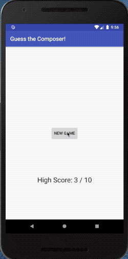 

1. **AddExoPlayer** - 添加 ExoPlayer（可扩展的媒体播放器库）。你还会将其连接到 SimpleExoPlayerView，后者是一个 UI 元素，属于 ExoPlayer 库的一部分，其中包括播放控件和专辑封面。
2. **CustomizeLayout** - 自定义 SimpleExoPlayerView 以便仅包含你想支持的播放控件。
3. **EventListening** - 添加EventListener，可以根据media player的状态（播放，暂停）输出log信息 
4. **AddMediaSession** - 添加media session, 用media session 同步media player的状态，让我们可以用外部设备控制。
5. **AddMediaNotification** - 创建 MediaStyle 通知，它可以充当用于控制媒体会话、进而控制控制媒体播放的外部客户端。然后，修复 buildMediaButtonPendingIntent 通知操作，方法是创建能够对外部客户端操作做出响应的 MediaButtonReceiver

### Advanced-Lesson06 MyGarden - Widget
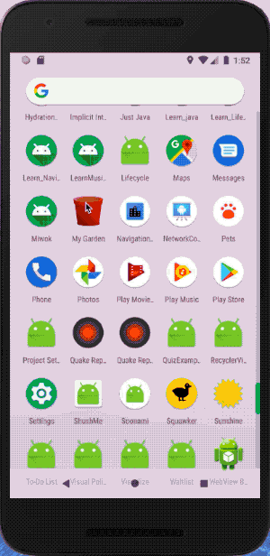 

1. **AddNewWidget** - 创建非常基础的小部件，该小部件可以放置在主屏幕上，被点击之后将在 MyGarden 应用中启动主 Activity。
2. **AddWateringService** - 在小部件上创建浇水按钮，该按钮会启动 IntentService 以更新花园中所有植物的浇水时间
3. **UpdateWidgetsService** - 创建另一个 IntentService 操作，该操作将查询需要最多关照的植物，然后更新小部件界面以显示该植物。
4. **Extras** - 修改widget，改成给最危险的那个植物浇水而不是给全部植物浇水，widget上显示最危险的那个植物，为了防止多浇水，如果时间很接近，就
不现实浇水图片
5. **GridView** - 将为小部件创建自适应界面，根据其尺寸更改布局。 当小部件的宽度大于 300dp 时，它将显示一个 GridView，其中包含花园中的所有植物，否则继续显示单棵植物。RemoteViewsService, RemoteViewsFactory, setOnClickFillInIntent, setPendingIntentTemplate, setEmptyView, onAppWidgetOptionsChanged

### Advanced-Lesson07 TeaTime - EspressoUITest

